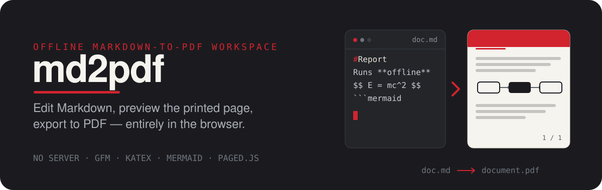

<p align="center">
  
</p>

<p align="center">
  <a href="https://hub.docker.com/r/overklassniy/md2pdf"></a>
  
  
  
  
  
</p>

# md2pdf

Offline Markdown-to-PDF workspace. Edit Markdown, preview the printed page, and
export to PDF – entirely in the browser. No server, no uploads: as a PWA the app
and every asset it needs (including KaTeX fonts) are cached locally.

## Features

- **Fully offline** – installable PWA, zero network requests after first load.
- **Live preview** – CodeMirror 6 editor beside the rendered document, scroll
  synced by source line; drag-and-drop or paste images straight into the editor.
- **Print-grade export** – browser print-to-PDF, or paged.js pagination with
  page numbers and running headers.
- **Standalone HTML export** – a single self-contained `.html` file with all
  styles inlined and KaTeX fonts embedded as data URIs; also `.md` download.
- **Page setup** – A4 / Letter / Legal, portrait or landscape, four margin
  presets.

## Quick start

Requires Node.js >= 22.12 and pnpm 12 (via corepack).

```bash
pnpm install
pnpm dev
```

Or run the production build in Docker:

```bash
docker compose up --build
# serves on http://localhost:8080
```

## Markdown support

| Feature                 | Syntax                                                                         |
| ----------------------- | ------------------------------------------------------------------------------ |
| GFM                     | tables, task lists, strikethrough, footnotes                                   |
| Math                    | `$inline$` and `$$block$$` via KaTeX                                           |
| Diagrams                | ` ```mermaid ` code blocks                                                     |
| Alerts                  | `> [!NOTE]` with optional custom titles                                        |
| Callouts                | `:::note`, `:::tip`, `:::important`, `:::warning`, `:::caution` with `[Label]` |
| Table of contents       | `[TOC]` or `[TOC "Title"]` on its own line                                     |
| Images                  | ``; paste/drop embeds base64 data URIs                              |
| Page break              | `\newpage`, `\pagebreak`, or `:::pagebreak`                                    |
| Subscript / superscript | `~sub~` and `^sup^`                                                            |
| Definition lists        | `Term : definition`                                                            |
| YAML front matter       | `title`, `author`, `date`, `lang`, and more                                    |
| Extras                  | gemoji, smartypants, inline HTML, heading anchors                              |

## Exporting

- **Print / Save as PDF** – plain mode injects `@page` size and margin rules and
  opens the browser print dialog. Paged mode additionally runs paged.js, which
  adds margin boxes: a running header (`@top-center`) and `page / total`
  counters (`@bottom-center`).
- **Download .html** – all styles inlined; when the document contains math,
  KaTeX woff2 fonts are embedded as data URIs so the file renders fully offline.
- **Download .md** – the raw Markdown source.

## Tech stack

React 19, Vite 8, TypeScript, CodeMirror 6, unified/remark/rehype, KaTeX,
Mermaid, paged.js, vite-plugin-pwa (Workbox).

## License

[MIT](LICENSE)

## Development

| Command          | Purpose              |
| ---------------- | -------------------- |
| `pnpm dev`       | start the dev server |
| `pnpm build`     | production build     |
| `pnpm test`      | run Vitest           |
| `pnpm lint`      | ESLint               |
| `pnpm typecheck` | `tsc --noEmit`       |
| `pnpm format`    | Prettier             |

---

Originally based on [realdennis/md2pdf](https://github.com/realdennis/md2pdf).
